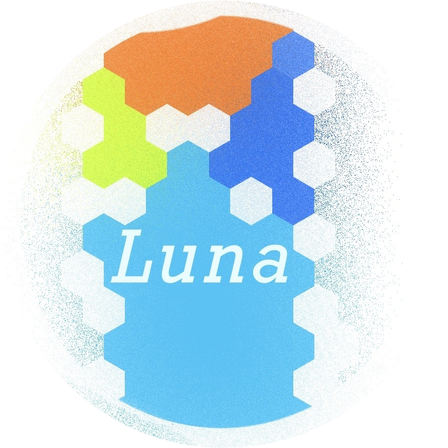

# Welcome to "Luna"! 👋
**Luna** is a custom language suite that can be used with all frameworks and libraries.
<br/><br/>


It can be integrated into frameworks and libraries such as **React** , **Vue** and all.

Please call us **LunaLang** like **GoLang**.

## What can it do? 🤔
Define your own properties, tags, use convenient predefined functions , lang compile, the possibilities are endless.

```Neither the moon's orbit nor its development will ever stop.```

Anyone is free to participate in the project.

### LICENSE
Thinking...
